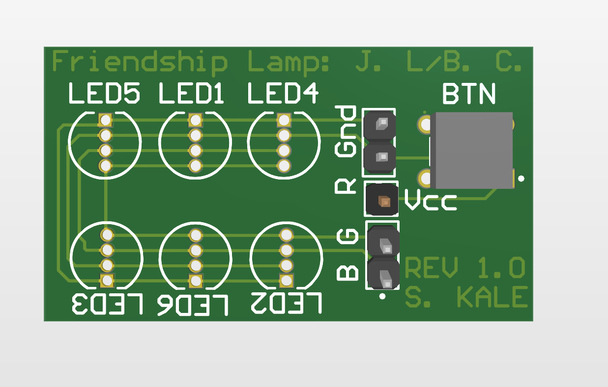

# Friendship Lamp LED board
  
This board was created to house 6 RGB LED's in parallel, as well as a push button on isolated headers that could be connected easily to a microcontroller 
- 2 Layer PCB designed to interface with raspberry pi's

Photo:

